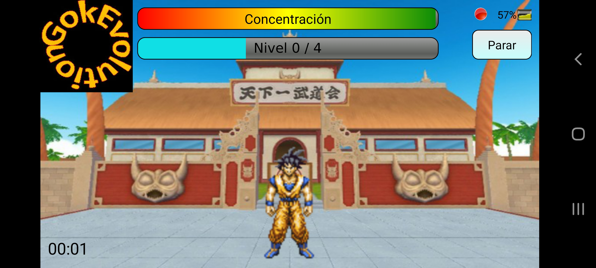
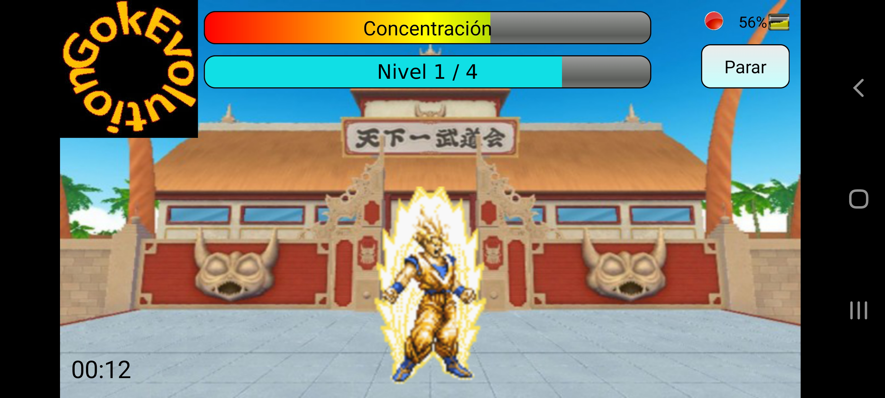
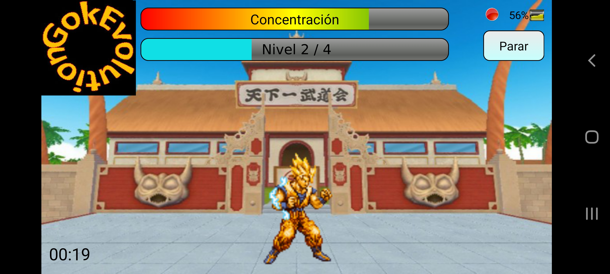
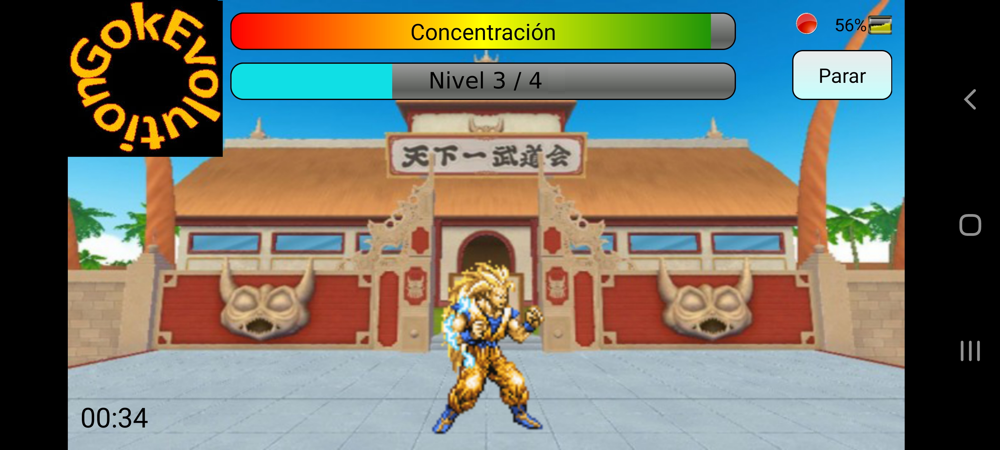
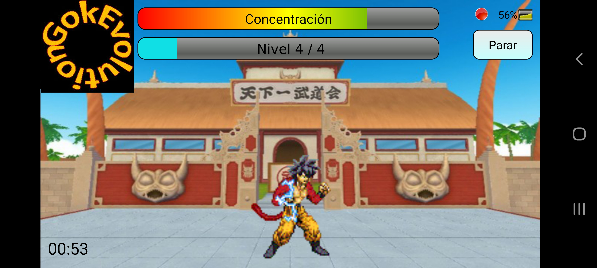
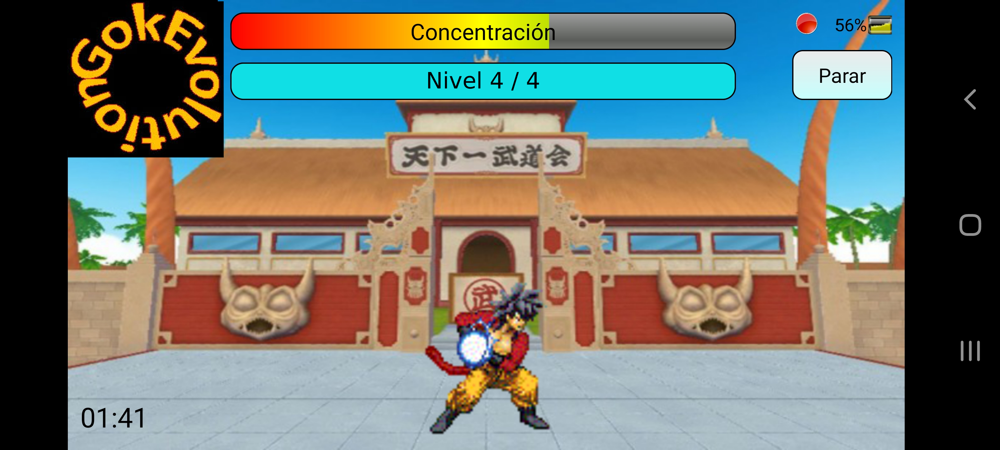
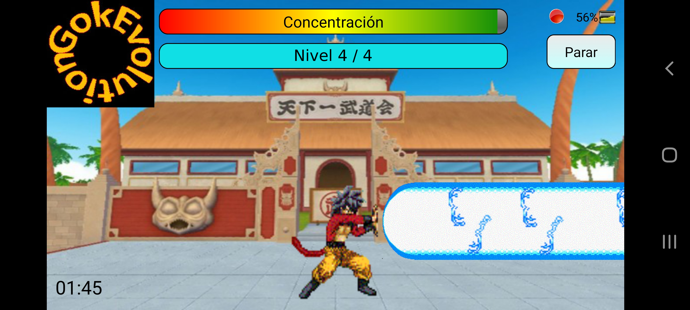
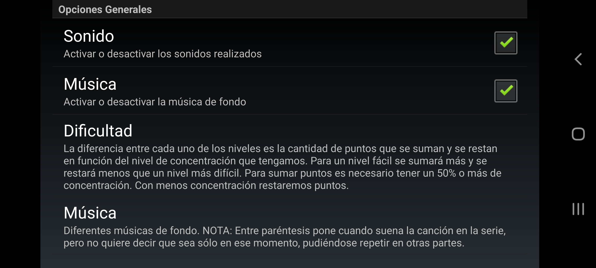

# EEG Mindroid GokEvolution

Source code [here](https://github.com/jaimegucu/EEGMindroidGokEvolution/tree/main/EEG%20Mindroid%20GokEvolution/src/com/app/eeg_mindroid_gokevolution)

## Screenshots

### Level 0 / 4

  

### Level 1 / 4

  

### Level 2 / 4

  

### Level 3 / 4

  

### Level 4 / 4

  

### The End

  

  

### Settings

  

